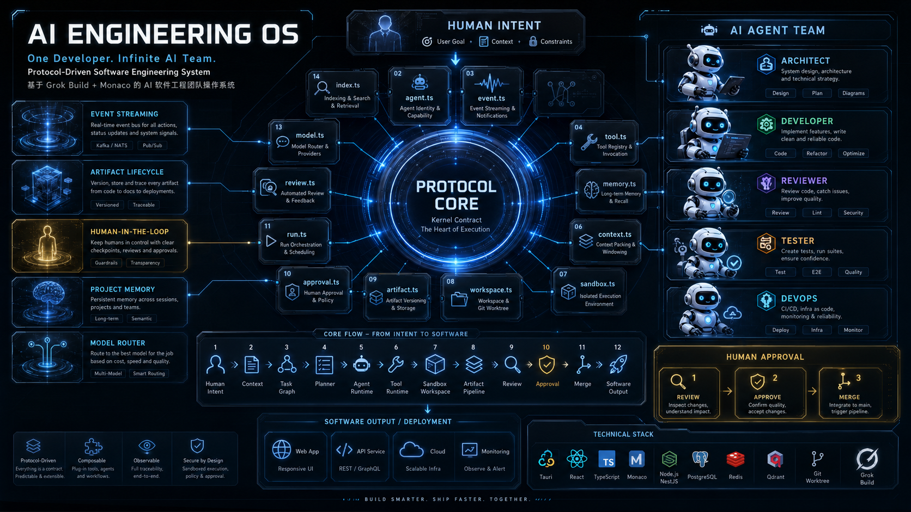

# AI Engineering OS

<p align="center">

</p>

<h3 align="center">
One Developer. Infinite AI Team.
</h3>

<p align="center">
A protocol-driven operating system for autonomous software engineering.
</p>

<p align="center">
Human Intent → AI Agents → Software
</p>

<p align="center">
🚧 Early Development — The architecture and protocol layer are under active development.
</p>

---

# Overview

Software engineering is entering a new paradigm.

For decades, software was built by human teams:

```
Product Manager
      ↓
  Architect
      ↓
  Developer
      ↓
  Reviewer
      ↓
   DevOps
      ↓
  Software
```

AI Engineering OS explores a future where one developer can orchestrate an entire AI engineering organization.

```
   Human
      ↓
AI Engineering OS
      ↓
 AI Agent Team
      ↓
Production Software
```

The goal is not to replace developers.

The goal is to amplify developers into engineering leaders.

---

# What is AI Engineering OS?

AI Engineering OS is an open-source, protocol-driven operating system for building and managing autonomous AI software engineering teams.

It provides:

- Agent orchestration
- Task planning
- Tool execution
- Project memory
- Sandbox isolation
- Artifact lifecycle management
- Human approval workflows
- Multi-model runtime support

Instead of treating AI as a chatbot, AI Engineering OS treats AI as a software engineering organization.

---

# Architecture

```
                     HUMAN INTENT
                          |
                          ↓

                ┌──────────────────┐
                │  Protocol Core   │
                │  Kernel Contract │
                └──────────────────┘

    ┌──────────────┬──────────────┬──────────────┐
    ↓              ↓              ↓
Planner Agent  Developer Agent  Reviewer Agent
    ↓              ↓              ↓

          Tool Runtime Layer

                   ↓

          Sandbox Workspace

                   ↓

          Artifact Pipeline

                   ↓

          Human Approval

                   ↓

             Software Output
```

---

# Core Philosophy

## 1. Protocol First

The future of AI systems will not be defined only by models.

Models will change. Infrastructure remains.

AI Engineering OS defines explicit communication contracts between:

- Humans
- Agents
- Tools
- Runtime
- Artifacts

Core protocols:

- Task Protocol
- Agent Protocol
- Event Protocol
- Tool Protocol
- Memory Protocol
- Artifact Protocol
- Approval Protocol

---

## 2. AI Agent Team

AI Engineering OS does not rely on a single intelligent agent.

Instead, it creates specialized AI roles.

```
            Product Goal
                ↓
          Planner Agent
    ┌───────────┼───────────┐
    ↓           ↓           ↓
Architect   Developer   Reviewer
    ↓           ↓           ↓
 Tester     Security    DevOps
```

Each agent has:

- Role
- Capability
- Permission
- Context
- Responsibility

---

## 3. Controlled Autonomy

AI should be autonomous. But autonomy requires control.

AI Engineering OS introduces Human-In-The-Loop workflows.

```
AI proposes
  ↓
 Review
  ↓
Approve
  ↓
Execute
```

High-risk operations require explicit approval:

- File modification
- Command execution
- Git operations
- Dependency installation
- Deployment

---

## 4. Sandbox First

AI never directly modifies the user's main environment.

Every task executes inside an isolated workspace.

```
Main Repository
   ↓
Agent Workspace
   ↓
Diff Review
   ↓
  Merge
```

Powered by:

- Git Worktree
- Workspace isolation
- Reproducible execution

---

# Protocol Layer

```
packages/protocol/src/
├── task.ts        # Task graph + version chain
├── agent.ts       # Agent communication
├── event.ts       # Event streaming + tracing
├── tool.ts        # Tool execution contract
├── memory.ts      # Project memory
├── context.ts     # User context + intent
├── sandbox.ts     # Sandbox protocol
├── workspace.ts   # Workspace management
├── artifact.ts    # Artifact lifecycle + lineage
├── approval.ts    # Human approval workflow
├── run.ts         # Execution tracking + cost
├── review.ts      # Code review protocol
└── model.ts       # Model routing interface
```

---

# Event Driven Architecture

Everything in AI Engineering OS is observable.

Agent actions are emitted as events:

```
Task Created
  ↓
Agent Started
  ↓
Tool Executed
  ↓
Files Changed
  ↓
Review Completed
  ↓
Human Approved
  ↓
Task Completed
```

---

# Artifact Lifecycle

AI generated outputs are treated as first-class engineering artifacts.

```
Draft → Proposed → Reviewed → Approved → Applied → Archived
```

Every artifact maintains:

- Version history
- Parent relationship
- Decision context
- Review records

---

# Technology Stack

## Desktop
- Tauri
- React
- TypeScript
- Monaco Editor

## Core Runtime
- Node.js
- Event-driven architecture
- Agent orchestration engine

## Storage
- PostgreSQL
- Redis
- Qdrant

## Agent Runtime
Compatible with:
- Grok Build
- OpenAI Agents
- Claude Agents
- Custom runtimes

---

# Project Structure

```
ai-engineering-os/
├── apps/
│   └── desktop/          # Tauri + Monaco
├── core/
│   ├── orchestrator/
│   ├── event-bus/
│   ├── sandbox-manager/
│   ├── artifact-engine/
│   └── approval-engine/
├── packages/
│   └── protocol/
├── runtimes/
│   ├── grok-build/
│   ├── openai/
│   └── claude/
├── examples/
├── docs/
└── README.md
```

---

# Roadmap

## Phase 1 — Core Runtime
- [x] Protocol architecture
- [ ] Task Graph Engine
- [ ] Agent Orchestrator
- [ ] Sandbox Manager
- [ ] Monaco Integration

## Phase 2 — AI Engineering Workflow
- [ ] Multi-Agent Collaboration
- [ ] Project Memory
- [ ] Artifact Management
- [ ] Code Review Agent

## Phase 3 — AI Engineering Platform
- [ ] Model Router
- [ ] MCP Ecosystem
- [ ] Cloud Sandbox
- [ ] Team Collaboration

---

# Example

**User:**

> Build a SaaS payment platform

**AI Engineering OS:**

```
Planner:   Analyze requirements
Architect: Design architecture
Developer: Implement system
Reviewer:  Check quality
Tester:    Validate behavior
DevOps:    Deploy
Human:     Approve release
```

Result: A complete software engineering workflow.

---

# Contributing

AI Engineering OS is an open-source project.

We welcome contributions in:
- Agent architecture
- Runtime adapters
- Developer tools
- Protocol design
- AI engineering workflows

---

# Vision

The next generation of software development will not be:

> "Humans writing code faster."

It will be:

> "Humans leading teams of intelligent software engineers."

---

# License

MIT License

---

<p align="center">
Built for the future of software engineering.
</p>
